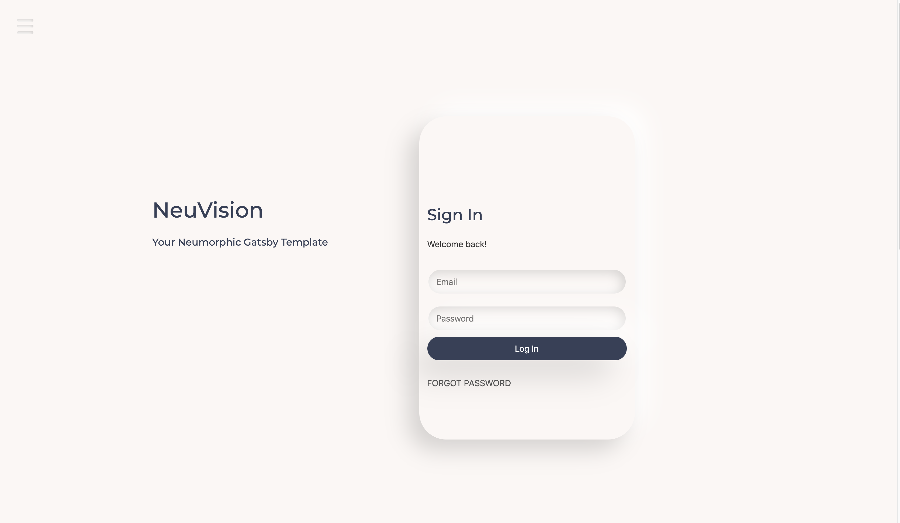

# NeuVision Gatsby Template

## Welcome! 👋

NeuVision is a Neumorphic Gatsby Template that is **AMP** ready, out of the package. You're Welcome.

**To see a live demo, click [here](https://hungry-elion-3babd3.netlify.app/).**

The NeuVision template was created & designed by me, [Kayla Gordon](https://twitter.com/kayla_finland). If you want to work together, let's talk. 🚀

## AMP ⚡

To get AMP set up, all you need to do is add your website domain to the `gatsby-config.js` file (for the `gatsby-plugin-react-helmet-canonical-urls` settings) and the `seo.js` component file.

### What do I update?

You need to replace "https://www.your-website.com" with your correct website domain.

Want an easy way to find it? In VS Code, do a search for "your-website" and voila!

## Any advice for the user login?

Yep! If you are using **AWS** for your user login and registration, here's a handy dandy tutorial to make life easier.

- [Gatsby Auth starter with AWS Amplify](https://github.com/dabit3/gatsby-auth-starter-aws-amplify)

## "Can I contribute to NeuVision?"

Absolutely! Feel free to make improvements and send me a PR.
